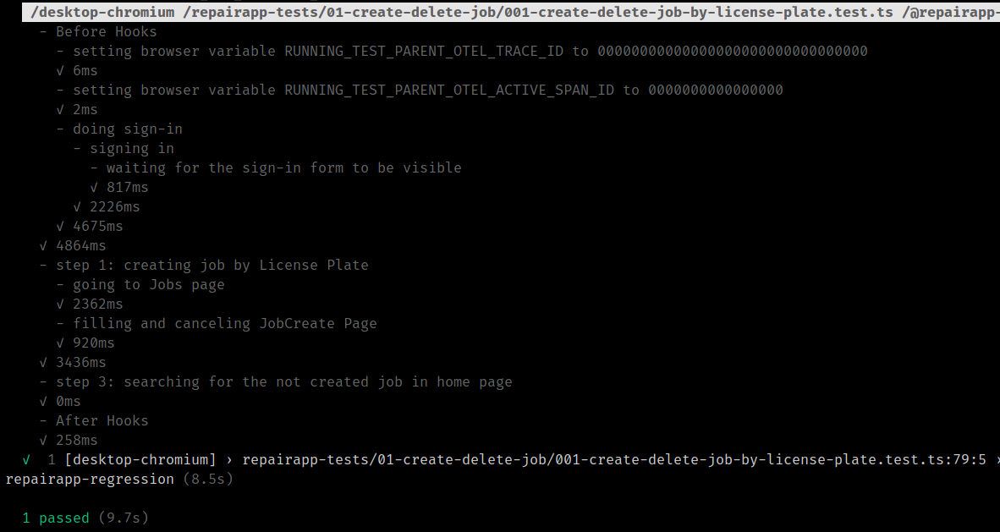
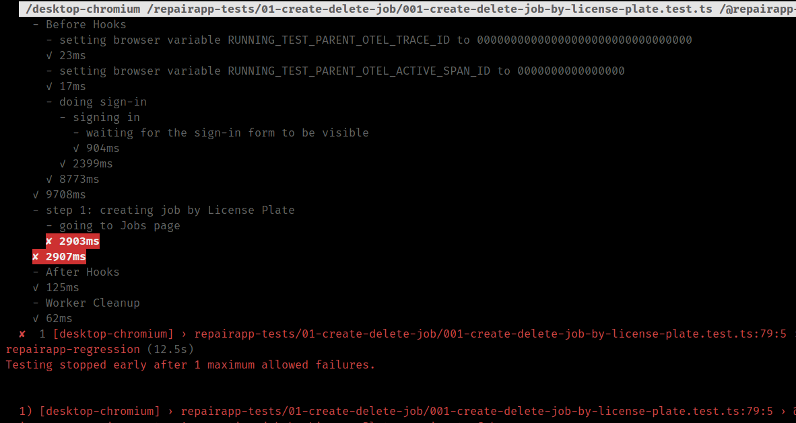

# Playwright Console Reporter

A custom console reporter for Playwright. This reporter captures steps and test results and formats them into structured reports and logs test execution details directly to the console. The reporter provides deeper insights into the test suite’s performance and helps developers quickly analyze test results without needing to open additional report files.




## Installation

To use this reporter, install it via npm:

```sh
npm install @playwright-console-reporter --save-dev
```

## Usage

To integrate the console reporter into your Playwright test configuration, modify your `playwright.config.ts file` as follows:

```typescript
// Ansure you have @playwright/test installed
import { PlaywrightTestConfig } from '@playwright/test';  

let reporters: PlaywrightTestConfig['reporter'] = [
  ['junit', { outputFile: 'build/results.xml' }],
  ['html', { outputFolder: 'build/html-report', open: 'never' }],
  ['list']
];

// Add the console reporter
reporters.push(['@playwright-console-reporter', {}]);

const config: PlaywrightTestConfig = {
  reporter: reporters,
  // other Playwright configurations...
};

export default config;

```

In order to run the tests in your project, set the environment variable:

```
PLAYWRIGHT_FORCE_TTY=false
```
This will ensure the detailed reports will be printed line by line.

## For developers of this plugin

How to build?

```
pnpm install
pnpm build
```

How to release to npm?

1. Update `package.json` version field
2. Run build
3. Run `pnpm release`
4. Add git tag (update version) `git tag -a v1.0.0 -m "Release 1.0.0"`
5. Then push the tag to the remote repository
